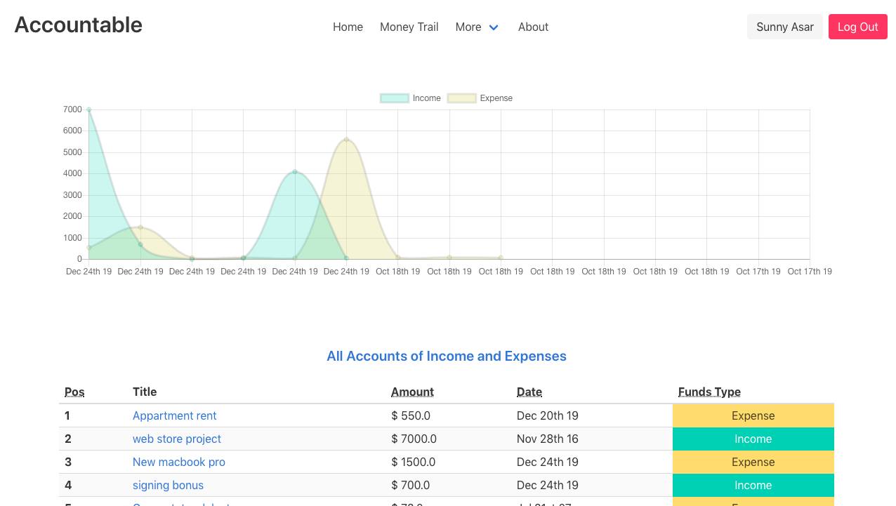

# Accontable
Accountable a way to handle and make sense of your finances.

Accountable provides a way to handle finances, track your income, expenditure and make more informed financial decisions. The data from each account is visuallized on a chart for the users sanitity.

## Built With

- Javscript, Ruby,
- Rails, Devise, React and Redux 
- Bulma and Sass.

## Getting Started

**This is what needs to be done to  on set up this project locally.**

To get a local copy up and running follow these simple example steps.

### Prerequisites

To run this project, you will need to have `Rails`,`Ruby`, `PostgreSql` and `npm` already installed locally

### Setup
`Clone the project and cd into the directory`

### Install
run `bundle install` to install all the dependencies of the project

run  `rails db:create` to create a new database for the project

run `rails db:migrate` to get the migration schema setup in the new tables in the database. 

### Usage
run `rails s` to get the project running

## Authors

👤 **Author**

- Github: [@SunnyAsar](https://github.com/SunnyAsar)
- Linkedin: [Sunny Asar](https://www.linkedin.com/in/sunny-asar-905648101/)

## 🤝 Contributing

Contributions, issues and feature requests are welcome!

Feel free to check the [issues page](issues/).

## Show your support

Give a ⭐️ if you like this project!

## 📝 License

This project is [MIT](lic.url) licensed.
